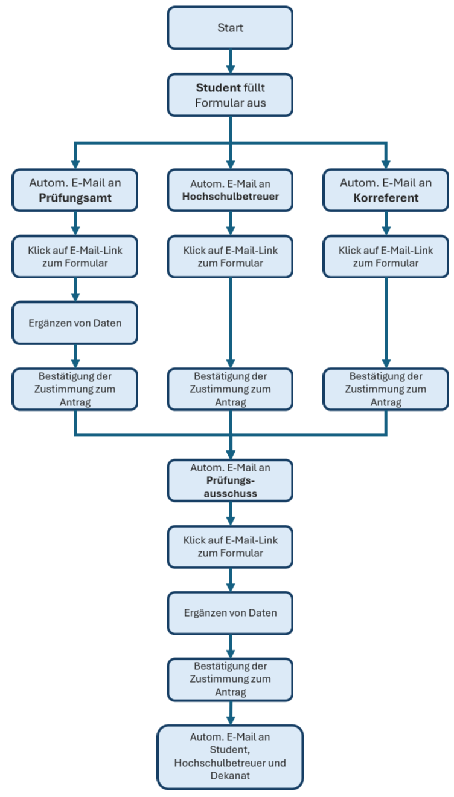

# verwalt-it
Webanwendung zum Bereitstellen von Formularen und Workflows für Verwaltungen.
Die Anwendung wird gehosted auf:

https://www.verwalt-it.de

Der jeweils aktuelle Entwicklungsstand ist hier erreichbar:
https://verwalt-it-test-25038b6e55cc.herokuapp.com


Die Anwendung ist noch nicht produktiv im Einsatz.

## Erster Usecase: Anmeldung zur Abschlussarbeit

Aktuell ermöglicht die Anwendung die Anmeldung zur Abschlussarbeit. Nutzer können sich über ein Formular registrieren und ihre relevanten Daten eingeben. Die Anwendung speichert diese. Dem angegebenen Betreuer wird eine Email gesendet, welche einen Link enthält, welche es erlaubt das Formular einzusehen und zu bestätigen.



## Tools
* npm, express, dotenv, mongoDB

## Entwicklung

### Umgebung konfigurieren
```
cp .env.example .env
```

### Installieren der Abhängigkeiten
```
npm install
```

### Start der Anwendung
```
npm start
```

### Verifikation
Die Anwendung steht dann im Browser unter
```
http://localhost:3000
```
zur Verfügung.


Health-Check testen:
```
curl http://localhost:3000/api/health
```
Erwartete Antwort: `{"status": "ok", "timestamp": "..."}`


### MongoDB Varianten
Im normalen betrieb wird eine MongoDB verwendet. Dafür muss sie über die Umgebung konfiguriert werden
indem der Wert `MONGODB_URL` gesetzt wird.

Um die Anwendung leichter testen zu können, kann auch eine einfache Mock-Datenbank, welche direkt
im Speicher der Anwendung liegt konfiguriert werden: `USE_MOCK_DB=true`.
Das ist der empfohlene Weg für Entwicklung an der Anwendung.

Eine weitere Variante ist es eine volle MongoDB, die im Speicher liegt zu starten. Das erlaubt
es insbesondere sicherzustellen, dass verwendete Funktionen sich mit einer echten MongoDB
gleich verhalten werden. Dafür muss die in-memory MongoDB installiert werden:
```
npm install mongodb-memory-server@10.2.0
```
Über die Umgebungsvariablen kann man diese dann verwenden:
```
USE_IN_MEMORY_DB=true
USE_MOCK_DB=false
```
Das Packet ist nicht in den normalen- oder dev-dependencies, damit das repo einfach und schnell mit
dem üblichen `npm install` Komando installiert werden kann, ohne diese etwas schwergewichtige
Abhängigkeit.

## Wichtige API-Endpunkte

- `GET /api/health` – Statusabfrage
- `POST /api/submit-form` – Formular absenden
- `POST /api/get-form-data` – Formulardaten per Token abrufen

## Verzeichnisstuktur
```
├── server.js           # Main Express server entry point
├── package.json        # Dependencies and scripts
├── .env                # Konfiguration über "dotenv"
│
├── api/                # Backend-API-Module
│   ├── index.js        # Express-Routen
│   ├── dataStore.js    # Datenbankoperationen
│   ├── dbConnect.js    # Datenbankverbindung
│   ├── mockDatabase.js # In-Memory Mock-Datenbank
│   └── renderEmail.js  # E-Mail-Template Rendering
│
└── public/             # Statische Frontend-Dateien
    ├── index.html      # Startseite
    ├── style.css       # Globale Styles
    │
    ├── assets/         # Bilder und Assets
    │   └── logo.png    # Logo der Anwendung
    │
    └── form/           # Anmeldung zur Abschlussarbeit
        ├── index.html      # Formularseite
        ├── main.js         # Formular-Logik
        ├── confirm.html    # Bestätigungsseite
        ├── confirm.js      # Logik für Bestätigungsseite
        └── datenschutzerklaertung/
            └── index.html  # Datenschutzerklärung
```
